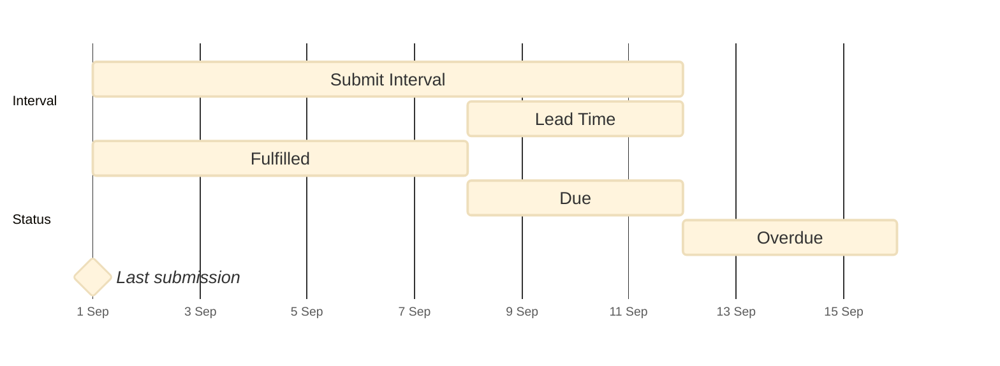

# Intervals & Lead Times

**Submit Intervals** and **Lead Times** can be configured for requirements such as documents, e-learning, and checklists. This guide explains how these concepts work, along with how they define due and overdue states.

| Term | Description | Example |
| :--- | :--- | :--- |
| Submit interval | A defined period of time representing the maximum interval between submissions. | An Annual Service requirement would have a submit interval of 1 year. |
| Lead time | A defined period of time that represents advanced notice before the end of an interval. | An Annual Service requirement may have a lead time of 14 days, allowing sufficient time to schedule the service. |
| Requirement fulfilled | The time between the last submission and the start of the lead time. | An Annual Service was last submitted 6 months ago. It is currently fulfilled. |
| Requirement due | The time since the last submission is within the requirement's defined submit interval but after the lead time begins. | An Annual Service was last submitted 11 months and 20 days ago. It is not yet overdue, but it is within its 14-day lead time. It is currently due. |
| Requirement overdue | The time passed since the last submission is beyond the requirement's defined submit interval. | An Annual Service was last submitted 13 months ago. It is currently overdue. |

